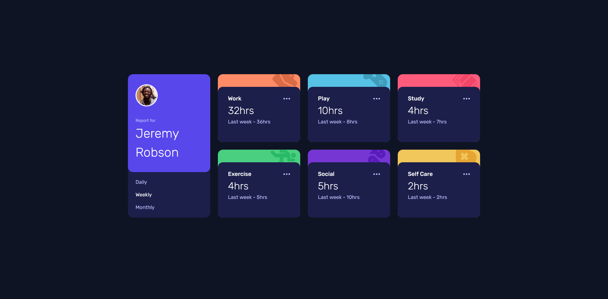

# Frontend Mentor - Time tracking dashboard solution

This is a solution to the [Time tracking dashboard challenge on Frontend Mentor](https://www.frontendmentor.io/challenges/time-tracking-dashboard-UIQ7167Jw). Frontend Mentor challenges help you improve your coding skills by building realistic projects. 

## Table of contents

- [Overview](#overview)
  - [The challenge](#the-challenge)
  - [Screenshot](#screenshot)
  - [Links](#links)
- [My process](#my-process)
  - [Built with](#built-with)
  - [What I learned](#what-i-learned)
  - [Continued development](#continued-development)
- [Author](#author)
- [Acknowledgments](#acknowledgments)

## Overview

### The challenge

Users should be able to:

- View the optimal layout for the site depending on their device's screen size
- See hover states for all interactive elements on the page
- Switch between viewing Daily, Weekly, and Monthly stats

### Screenshot

### Links

- Live Site URL: 

## My process

### Built with

- CSS custom properties
- Flexbox
- CSS Grid
- Mobile-first workflow

### What I learned

Implicit grid is harder than it looks. After a lot of trying, I realize that it's impossible skip the first column without a explicit grid. I could just split it in two containers div and use this to place items, but there is no reason to change it right now.

### Continued development

Definitely I'll focus on learn how to work with grid.(It's a powerful tool to master.)

I'll also focus on improve build complex layouts, this exercise show me how important is work with a good plan. 

# Author

- Website - [Carlos André](https://carlosandre.tec.br)
- Frontend Mentor - [@carlosChamp](https://www.frontendmentor.io/profile/carlosChamp)
